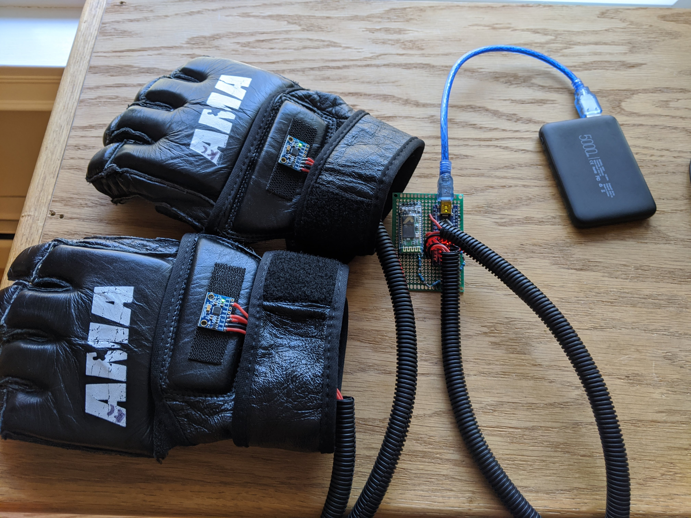
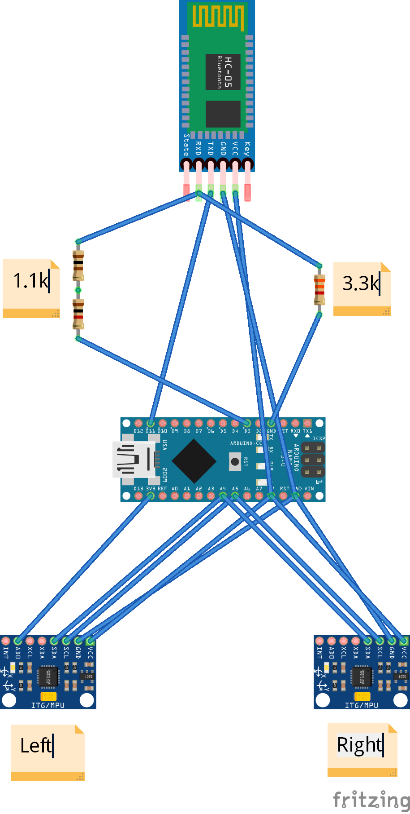

# Shadow Boxer
 An Arduino powered Krav Maga punch combo assistant.

 I created this to continue practicing Krav Maga during the Covid-19 pandemic. 

 

 ## Android app
 To make the most of this project, install the [Shadow Boxer](https://github.com/kylecorry31/shadow-boxer-android) Android app.

 ## Materials Used
 - Arduino Nano
 - HC-05 bluetooth module
 - 2 x MPU-6050
 - 100kΩ resistor
 - 100Ω resistor
 - 3.3kΩ resistor
 - USB battery pack
 - Boxing or MMA gloves
 - Wire tube
 - 22 AWG wire
 - Micro USB cable
 - Velcro
 - PCB or breadboard (either)
 - Solder

## Libraries Required
- [Adafruit MPU6050](https://github.com/adafruit/Adafruit_MPU6050)

## Assembly

1. Cut 9 lengths of 22 AWG wire and 2 wire tubes to extend comfortable from your lower back to your outstreched hand with a bit of slack.

2. Assemble the following circuit on a PCB or breadboard.

3. Attach the MPU 6050s onto the gloves using velco. The sensor should be on top of the glove (resistor side up) with the wires extending toward the wrist as seen in the completed photo at the top of this page.

4. Upload this sketch onto the Arduino after installing the required library.

5. On an Android phone, install the [Shadow Boxer](https://github.com/kylecorry31/shadow-boxer-android) app.

6. Follow the instructions within the Android app to connect to the Shadow Boxer gloves.